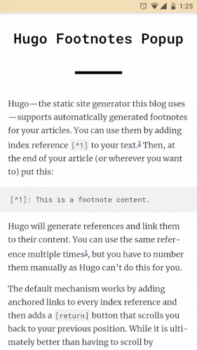

# Hugo Footnotes Popup




**Hugo Footnotes Popup** is a pure JavaScript plugin to display footnotes at the bottom of your page. It is only 2 KB and can be used on Hugo website (for Jekyll see below). With JavaScript disabled, nothing will change and users can freely use the default anchor-style footnotes.

## Setup

To use this plugin download `footnotes.js` file and insert it to your `static` directory inside Hugo. Then put following code at the end of your HTML template. Inner content will be created at the runtime so no artifacts will appear when you disable JavaScript.

```html
<div class="bottom-panel" id="bottom-panel">
    <div class="popup-wrapper" id="popup-wrapper"></div> 
</div> 
<script src="./footnotes.js"></script>
```

You can change the visibility of footnote number and close button inside `footnotes.js` file. And the end of `footnotes.js` file edit function call parameters. To disable footnote number or close button, set their values to `false`.

```javascript
footnotePopup(false, false);
```
This plugin requires basic CSS to work. View reference styles in `main.css`.

## Jekyll users
Check [this issue](https://github.com/vaetas/hugo-footnotes-popup/issues/4). You can use this plugin with Jekyll but further configuration is required.
